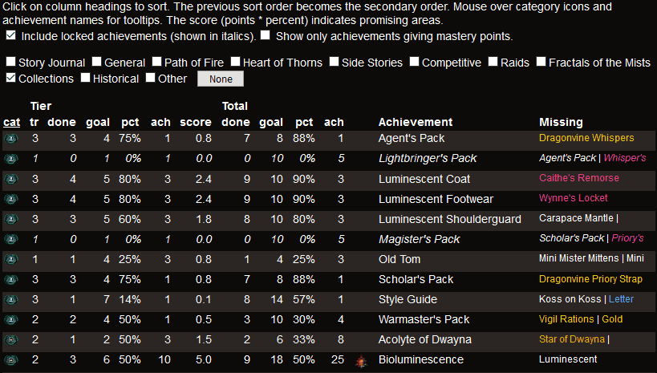

Guild Wars 2 API
================

This web-based app provides support for the game [Guild Wars
2](https://www.guildwars2.com/).  It uses the [game
API](https://wiki.guildwars2.com/wiki/API) to provide pages that display
game-related information in a more concise way.  The
[documentation](./doc/README.md) provides more information about the various
pages.  Links to items are color-coded by rarity.  Links conduct searches in
the [Guild Wars 2 Wiki](https://wiki.guildwars2.com/wiki/Main_Page).

* Achievements.  Lists available achievements that can be sorted and filtered
  by different criteria.

* Equipment.  Lists the equipment of all characters.

* Inventory.  Lists the inventory of all characters grouped by item classes.

* Wallet.  Displays the contents of the wallet.

* Bank.  Lists the content of the bank grouped by item classes.

* Materials.  Lists materials stored in the bank.

* Skins.  Displays all skins available in the game with the ones not yet
  unlocked grayed out.

* Recipe Skins.  Displays locked skins for which the recipe is known.

Usage
-----

Flask may run the app locally.  After installing Flask, you can run this
command in a bash Terminal:

    FLASK_APP=gw2api flask run

In Windows, you can set the environment variable `FLASK_APP=gw2api` and do the
same in a Command Prompt or Powershell.

See below for changing the location of the cache database.

Now, you can open this page in a web browser:
`http://127.0.0.1:5000/static/index.html`

If you have access to a web server running Apache, you can configure
[mod_wsgi](https://modwsgi.readthedocs.io/) using the [sample
configuration](./sample-mod_wsgi.conf).

While you can access the pages as `https://server/gw2api/static/index.html`, it
is preferable to have Apache serve the static pages.  That requires configuring
Apache to serve the content of [gw2api/static](./gw2api/static), maybe after
copying it elsewhere.  The file [api-url.js](./gw2api/static/js/api-url.js)
needs to be edited.  For the sample configuration, it should have this content:

    export const api_url_prefix = '/gw2api/';

API Key
-------

The game API requires an [API
key](https://wiki.guildwars2.com/wiki/API:API_key) with the appropriate
permissions.  API keys may be put into the file `keys.ini` in the [Python
directory](./gw2api).  The file [keys.txt](./gw2api/keys.txt) provides a
template and lists all the permissions the app looks for.  Multiple permissions
are separated by "_" and sorted alphabetically.  The same API key may be used
to fill multiple slots as long as it has sufficient permissions.

Instead of putting the keys into `keys.ini`, they may also be provided as a
parameter to the web requests (`?key=ABC...XYZ`).  HTML pages forward that
parameter to other HTML pages and to back-end requests.

Frameworks
----------

On the server-side, the app uses [Python](https://www.python.org/),
[SQLite](https://www.sqlite.org/), and
[Flask](https://palletsprojects.com/p/flask/) to query the Guild Wars 2 API, to
cache data, and to deliver data as JSON to the web app.  It should go without
saying that Python 3 is required.

On the client side, the UI is rendered by [React](https://reactjs.org/)
(without [JSX](https://reactjs.org/docs/introducing-jsx.html)).  Modern web
browsers should be able to display all pages (tested with Chrome, Firefox,
Safari).

Cache
-----

Because the game API is slow, non-user specific data is cached in an SQLite
database for a week.  By default, the database is located in the file
`cache.db` in the Python directory (size about 10 MB).  The location may be
changed by editing the value of the variable `default_db_path` in
[gw2cache.py](./gw2api/gw2cache.py).  When new game content is released, that
cache file may need to be deleted manually if waiting for a week is not
acceptable.  Without a cache, it may take a minute for some pages to display
the results.

Flask
-----

This project needs at least Flask 1.0 to run.  In Ubuntu 18.04 and earlier,
install it with `pip3` (Ubuntu 20.04 includes a sufficiently new version of
Flask):

    sudo pip3 install flask

There may be a better way to organize the Flask directory structure.
Suggestions are welcome.

Other Uses of the API
---------------------

I will accept PR's if there are other suggestions for displaying API results.
I may also take requests if I find a new way to display API results
compelling.  Just submit an issue for the latter.
