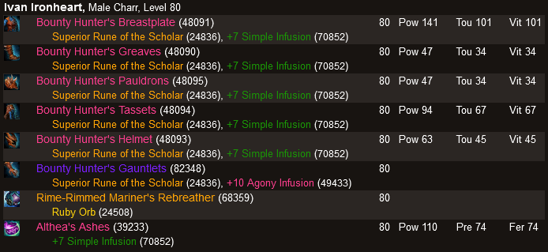
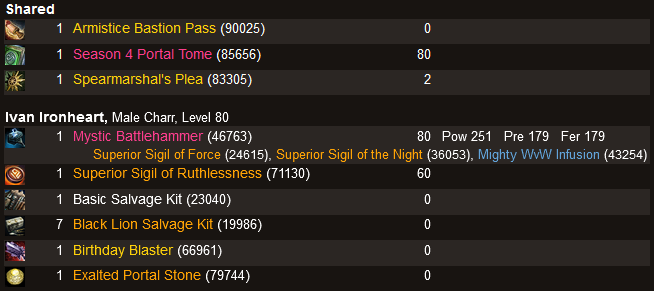
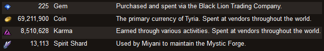
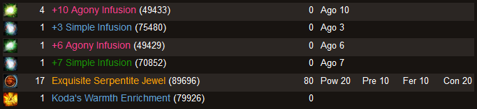
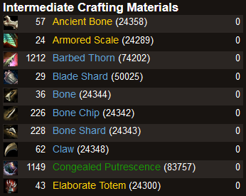
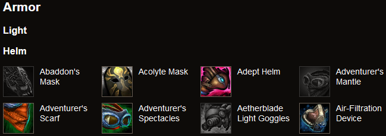
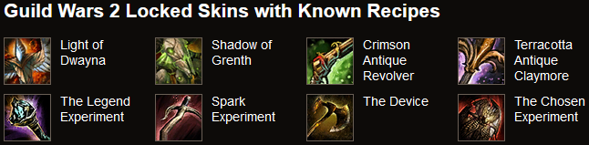

Documentation of the Provided Pages
===================================

All pages contain links to items and achievements.  In those links, an item's
[rarity](https://wiki.guildwars2.com/wiki/Rarity) is indicated with the
official colors.  Links conduct searches in the [Guild Wars 2
Wiki](https://wiki.guildwars2.com/wiki/Main_Page).  For transmuted items, the
skin name is displayed but the original name is used in the search.  Numbers in
parentheses are item identifiers with links to
[GW2Spidy](https://www.gw2spidy.com/).

[Achievements](#achievements) | [Equipment](#equipment) |
[Inventory](#inventory) | [Wallet](#wallet) | [Bank](#bank) |
[Materials](#materials) | [Skins](#skins) | [Recipe Skins](#recipe-skins)

Achievements
------------

Lists available achievements that can be sorted and filtered by different
criteria. Clicking on "Show only achievements giving mastery points" is helpful
for determining how one can get more mastery points.  "ach" indicates the
remaining achievement points for tier and total.  For repeatable achievements,
the total remaining achievement points is the remainder of the point cap.  Only
the first line of missing items for a collection is shown.  The other lines
are shown on mouse-over.

Equipment
---------

Lists the [equipment](https://wiki.guildwars2.com/wiki/Equipment) of all
characters.

Inventory
---------

Lists the [inventory](https://wiki.guildwars2.com/wiki/Inventory) of all
characters grouped by item classes.  This is especially useful with many
characters if one cannot remember which character holds a particular item.

Wallet
------

Displays the contents of the [wallet](https://wiki.guildwars2.com/wiki/Wallet).

Bank
----

Lists the content of the [bank](https://wiki.guildwars2.com/wiki/Bank) grouped
by item classes.

Materials
---------

Lists the content of the [material storage
tab](https://wiki.guildwars2.com/wiki/Material_storage) of the bank.

Skins
-----

Displays all [skins](https://wiki.guildwars2.com/wiki/Skin) available in the
game with the ones not yet unlocked grayed out.

Recipe Skins
------------

Displays locked skins for which the recipe is known.
